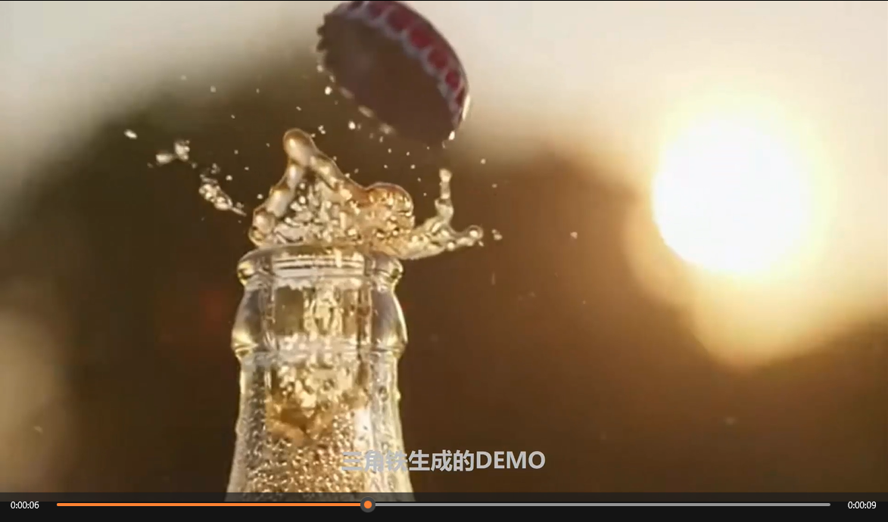
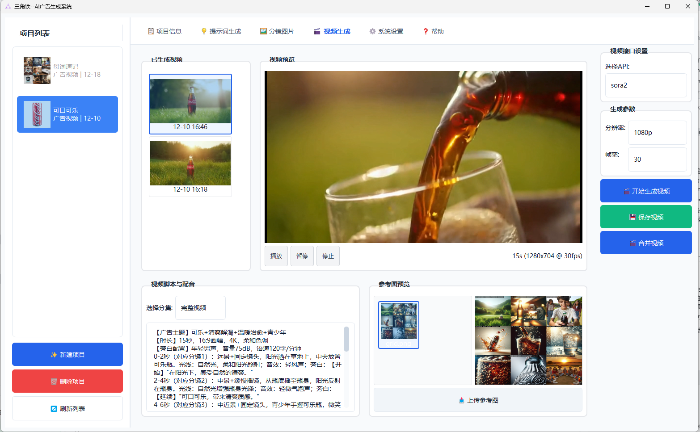
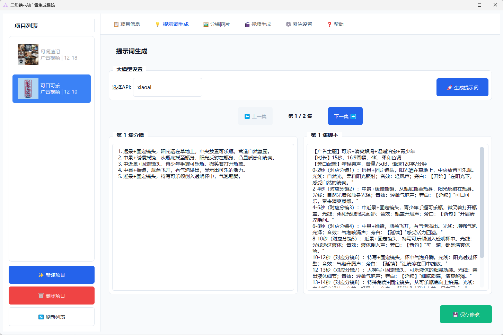

# Triangle - AI Advertising Video Generation System / 三角铁--AI广告视频生成系统

<p align="center">
    
</p>

<p align="center">
    <a href="#english">English</a> | <a href="#chinese">中文</a>
</p>

<div id="english">

## Introduction

Triangle is a local desktop application designed for SMEs and individual users to automatically generate professional advertising and promotional videos using AI technology.

### Core Features
- **Smart Generation**: Uses LLM to generate professional storyboards and video script prompts based on keywords and reference images.
- **Storyboard Creation**: Calls image generation APIs to create 9-grid storyboard images.
- **Video Synthesis**: Calls video generation APIs to synthesize complete videos.
- **Customization**: Supports editing prompts, replacing storyboard frames, and other personalized adjustments.

## System Architecture

```
ad_tool/
├── src/                      # Source Code
│   ├── models/              # Data Models
│   ├── services/            # Business Services (LLM, Image, Video)
│   ├── ui/                  # User Interface (PyQt6)
│   └── utils/               # Utilities (Config, Logger)
├── data/                    # Data Directory
├── projects/                # Project Files Storage
├── logs/                    # Log Files
├── resources/               # Resources
├── main.py                 # Entry Point
├── requirements.txt        # Python Dependencies
└── ad_tool.spec           # PyInstaller Config
```

## Installation and Run

### Development Environment

#### Option 1: Virtual Environment (Recommended)

**A. Fast Install (Reuses system packages) ⚡**
```bash
# One-click: Create venv + Reuse system packages + Install missing deps
setup_venv_fast.bat
```

**B. Standard Install (Isolated environment)**
```bash
# Create venv
setup_venv.bat

# Install dependencies
install_venv.bat
```

**Run:**
```bash
run_venv.bat
```

#### Option 2: Direct Install

1. **Install Python 3.10+**
2. **Install Dependencies:**
   ```bash
   pip install -r requirements.txt
   ```
3. **Run:**
   ```bash
   python main.py
   ```

### Build EXE

**Using Virtual Environment (Recommended):**
```bash
build_venv.bat
```

**Manual Build:**
```bash
pip install pyinstaller
pyinstaller ad_tool.spec
```
The executable will be in the `dist/` directory.

## Usage Workflow

1. **Create Project**: Enter project name, product info, video type, duration, style, and optional reference images.
2. **Generate Prompts**: AI generates 9 storyboard prompts and a full video script. You can edit them manually.
3. **Generate Frames**: System generates a 9-grid storyboard using image APIs. You can regenerate individual frames.
4. **Generate Video**: Configure resolution and frame rate, then generate the final video.

## API Configuration

- **LLM API**: OpenAI (GPT-4o), Baidu Wenxin, Aliyun Qwen.
- **Image API**: Stability AI (SDXL), OpenAI (DALL-E 3), Midjourney.
- **Video API**: OpenAI Sora 2, Pika Labs, Runway.

## System Requirements

- **OS**: Windows 10/11
- **Python**: 3.10+ (for development)
- **RAM**: 4GB+ recommended

## Declaration
- Pursuant to the "AS IS" clause of the Apache License 2.0, the author shall not be liable for the legality or compliance of the short drama content generated by the system, nor shall the author be liable for any losses caused by the improper use of the system by users.
- Commercial use of this system is permitted (e.g., providing paid advertising generation services, internal enterprise use, etc.), but during commercial use, users must be explicitly informed of the open-source nature of this system and the constraints of the Apache License 2.0.
- If you modify, secondary develop and distribute this system, you must clearly mark the modification records (including modification content, modification time, and modifier) in the modified code, and retain the original copyright statement and this license text.

</div>

---

<div id="chinese">

## 系统简介

三角铁--AI广告视频生成系统是一款面向中小企业和个人用户的本地桌面应用，通过AI技术自动生成专业的广告和宣传片视频。

### 核心功能
- **智能生成**：基于关键词和参考图片，使用LLM生成专业的分镜和视频脚本提示词
- **分镜创作**：调用图片生成API创建九宫格分镜图片
- **视频合成**：调用视频生成API合成完整视频
- **个性化**：支持提示词编辑、分镜替换等个性化调整

## 演示与截图

### 演示视频
[](addemovideo.mp4)

### 软件截图
 

## 下载地址
[下载打包版 (夸克网盘)](https://pan.quark.cn/s/16750788911f)

## 系统架构

```
广告视频生成系统/
├── src/                      # 源代码
│   ├── models/              # 数据模型 (database.py, project.py)
│   ├── services/            # 业务服务 (llm, image, video)
│   ├── ui/                  # 用户界面 (main_window, panels)
│   └── utils/               # 工具模块 (config, logger)
├── data/                    # 数据目录 (projects.db, config.json)
├── projects/                # 项目文件存储
├── logs/                    # 日志文件
├── resources/               # 资源文件
├── main.py                 # 程序入口
├── requirements.txt        # Python依赖
└── ad_tool.spec           # PyInstaller配置
```

## 安装和运行

### 开发环境运行

#### 方式一：使用虚拟环境（推荐）

**A. 快速安装（复用系统已安装的包）⚡**
```bash
# 一键完成：创建虚拟环境 + 复用系统包 + 安装缺失依赖
setup_venv_fast.bat
```

**B. 标准安装（完全独立环境）**
```bash
# 创建虚拟环境
setup_venv.bat

# 安装依赖
install_venv.bat
```

**运行程序：**
```bash
run_venv.bat
```

#### 方式二：直接安装

1. **安装Python 3.10+**
2. **安装依赖包：**
   ```bash
   pip install -r requirements.txt
   ```
3. **运行程序：**
   ```bash
   python main.py
   ```

### 打包为EXE

**使用虚拟环境打包（推荐）：**
```bash
build_venv.bat
```

**直接打包：**
```bash
pip install pyinstaller
pyinstaller ad_tool.spec
```
打包完成后，可执行文件位于 `dist/` 目录。

## 使用流程

1. **创建项目**：填写项目基础信息、视频类型、时长、风格，上传参考图片。
2. **生成提示词**：AI自动生成9个分镜的图片提示词和完整的视频脚本提示词，支持手动编辑。
3. **生成分镜图片**：系统调用API创建九宫格分镜，支持单独重绘。
4. **生成视频**：设置参数后生成最终视频，支持预览和导出。

## API配置说明

- **LLM API**：OpenAI (GPT-4o), 文心一言, 通义千问。
- **图片生成API**：Stability AI (SDXL), OpenAI (DALL-E 3), Midjourney。
- **视频生成API**：OpenAI Sora 2, Pika Labs, Runway。

## 系统要求

- **操作系统**: Windows 10/11
- **Python**: 3.10+ (开发环境)
- **内存**: 建议4GB以上


## 声明

- 根据Apache 2.0“AS IS”条款，作者不对系统生成的短剧内容的合法性、合规性承担责任，亦不对系统因用户不当使用导致的任何损失承担责任。
- 允许将本系统用于商业用途（如提供付费广告生成服务、企业内部使用等），但商用过程中需向用户明示本系统的开源属性及Apache 2.0许可证约束。
- 若你基于本系统进行修改、二次开发后分发，需在修改后的代码中明确标注修改记录（包括修改内容、修改时间、修改人），并保留原始版权声明和本许可证文本。

</div>

# Triangle
三角铁，AI广告生成系统 Triangle, An AI Ad Tool

